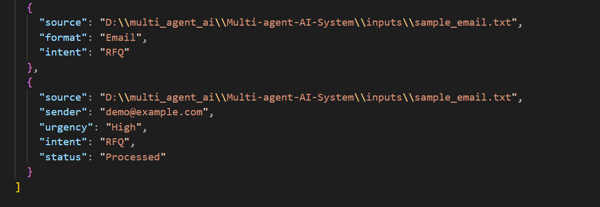
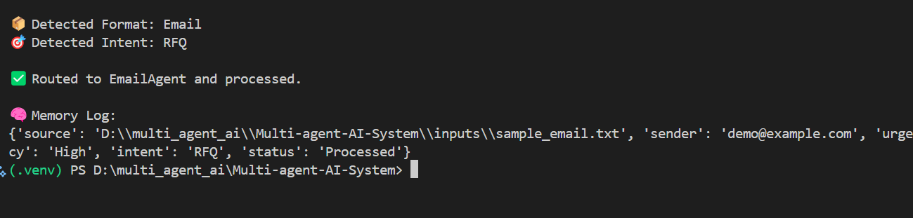

# Multi-Agent AI System

[](https://www.python.org/)
[](LICENSE)
[](https://huggingface.co/MoritzLaurer/DeBERTa-v3-base-mnli-fever-anli)

> Built by [@Saptarshi767](https://github.com/Saptarshi767) — A modular, intelligent document classification system.

---

## Objective

To build a scalable and modular AI system that:

- Accepts input files in PDF, JSON, or Email (text) format.
- Automatically classifies the input by format and intent.
- Routes the input to a specific agent based on classification.
- Extracts structured information and stores it in shared memory.
- Maintains traceability for all interactions.

---

## Features

- Format Detection: PDF, JSON, or Email
- Intent Classification using open-source LLM
- JSON and Email Agent routing
- Field extraction and validation
- Shared memory via in-memory or Redis
- Log storage in `outputs/logs.json`

---

## System Architecture

1. **Classifier Agent**
   - Detects input format and intent using LLM
   - Routes to the appropriate agent

2. **JSON Agent**
   - Validates fields in structured payloads
   - Detects anomalies

3. **Email Agent**
   - Extracts sender, urgency, and intent
   - Outputs CRM-compatible structure

4. **Shared Memory Module**
   - Saves extracted results, timestamps, and context

---

## Technologies Used

- Python 3.8+
- Transformers (HuggingFace)
- Torch
- Redis (Optional for persistent memory)
- PyPDF2
- Python-dotenv

---

## Folder Structure

```
multi_agent_ai/
├── agents/
│   ├── classifier_agent.py
│   ├── email_agent.py
│   └── json_agent.py
├── inputs/
│   ├── sample_email.txt
│   └── sample_payload.json
├── memory/
│   └── memory_store.py
├── outputs/
│   └── logs.json
├── utils/
│   └── parser_utils.py
├── main.py
└── requirements.txt
```

---

## Setup Instructions

1. Clone the repository:

```bash
git clone https://github.com/yourusername/Multi-agent-AI-System.git
cd Multi-agent-AI-System
```

2. Create a virtual environment (optional):

```bash
python -m venv .venv
.\.venv\Scriptsctivate      # Windows
source .venv/bin/activate     # macOS/Linux
```

3. Install dependencies:

```bash
pip install -r requirements.txt
```

---

## Running the System

```bash
python main.py
```

Then provide the path to a file when prompted, for example:

```
inputs/sample_email.txt
```

---

## Sample Output

### Email Input

`inputs/sample_email.txt`
```
Hi Team,

We are sending this RFQ for your product line.
Please respond ASAP.
```

**Output:**
```json
{
  "source": "inputs/sample_email.txt",
  "sender": "demo@example.com",
  "urgency": "High",
  "intent": "RFQ",
  "status": "Processed"
}

---

## Sample Output – Console Log



---
## Sample Output – JSON Log




---

## Future Improvements

- Add PDF invoice extraction support
- Web UI with FastAPI
- Chat thread-level memory with UUIDs
- Pluggable LLM backend with local/remote switch

---

## License

This project is licensed under the MIT License. See the [LICENSE](LICENSE) file for details.

---

## Author

[@Saptarshi767](https://github.com/Saptarshi767)

---

## Contributing

Pull requests are welcome. For major changes, please open an issue first to discuss what you would like to change.
